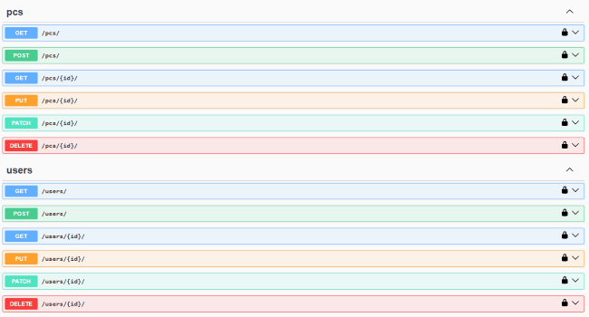

# 💼 Nico Wittemann – Personal Portfolio

Welcome to my personal portfolio! 🚀

I’m Nico Wittemann, a junior backend developer with a strong focus on Python, Django, and relational databases. This portfolio showcases my projects, my tech stack, and my professional background.

## 🌐 Live Version
👉 [View Portfolio](https://your-domain.com) *(optional if hosted online)*

## 📸 Screenshot


---

## 🔍 Overview

### 🧠 About Me
After graduating in electrical engineering and working two years as a PLC programmer, I discovered my passion for coding and transitioned into backend development.

### ⚙️ Tech Stack
- **Languages:** Python, HTML, CSS, JavaScript (basics)
- **Frameworks:** Django, Flask
- **Databases:** PostgreSQL, SQLite
- **Tools:** Git, GitHub, Swagger, pytest
- **Deployment:** Render

### 🛠️ Projects in the Portfolio
- **Custom PC Webshop API** – A full-featured Django REST API for selling PC components
- **Movie Project** – A full-stack application using Flask and SQLite

### 📬 Contact Form
Includes a ready-to-use contact form via Formspree – great for employers or recruiters.

### 🌍 Language Switcher
The site is available in both **English and German**. Visitors can switch languages via a dropdown menu.

---

## 📂 Project Structure
```
├── assets/
│   ├── img/                  # Project images and portrait
│   ├── Icons/                # Tech stack icons
├── css/
│   └── styles.css            # Custom styles
├── js/
│   └── scripts.js            # Bootstrap & custom JavaScript
├── index.html                # English version
├── index_de.html             # German version
└── README.md
```

---

## 🧑‍💻 Purpose of This Portfolio
My goal with this portfolio is to make a strong first impression with employers and present my skills as a backend developer in a professional way.

If you're looking for a motivated junior backend developer who’s eager to learn – **let’s talk!** 🙌

📧 [Contact via form](#contact)

---

## 📝 License
This project uses the [Creative theme by Start Bootstrap](https://startbootstrap.com/theme/creative) – MIT licensed.

---

Thanks for stopping by! ⭐
